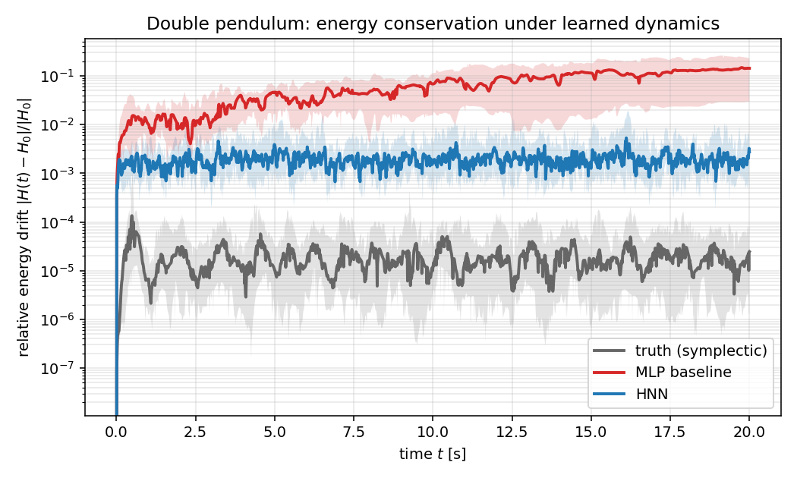

# Hamiltonian Neural Networks on the Double Pendulum

[](https://github.com/danringart/hnn-double-pendulum/actions/workflows/ci.yml)
[](LICENSE)
[](pyproject.toml)

A clean-room replication of **"Hamiltonian Neural Networks"** (Greydanus, Dzamba
and Yosinski, NeurIPS 2019) on the hardest of the three systems studied in the
paper: the planar double pendulum.

> Built by **Dan Ringart** — algorithm developer, B.Sc. Physics (Tel Aviv
> University, condensed matter & non-linear dynamics). This repo is a
> portfolio piece at the intersection of classical mechanics and modern
> machine learning.

A vanilla MLP trained to predict the time-derivative of a chaotic mechanical
system looks fine in-distribution but bleeds energy over long rollouts — it has
no reason not to. An HNN learns a scalar `H_θ(q, p)` and assembles its vector
field from autograd of that scalar as `(∂H/∂p, −∂H/∂q)`, so the symplectic
structure of Hamilton's equations holds exactly, for free, by construction.


## Headline result

Rolling 20 held-out initial conditions forward with classical RK4 for 2 000
steps (20 s of simulated time) and measuring the drift of the *true*
Hamiltonian along each predicted trajectory:

| Model                  | median `|ΔH|/|H₀|` at t=20 s | p75   | mean  |
|------------------------|-----------------------------:|------:|------:|
| Ground truth (symplectic)  | 2.5 × 10⁻⁵             | 8.1 × 10⁻⁵ | 1.2 × 10⁻⁴ |
| **MLP baseline**       | **1.44 × 10⁻¹**              | 2.30 × 10⁻¹ | 1.88 × 10⁻¹ |
| **HNN**                | **2.77 × 10⁻³**              | 5.57 × 10⁻³ | 8.20 × 10⁻³ |

The HNN conserves energy roughly **50× better** than the size-matched MLP,
reproducing the qualitative finding of Greydanus et al. (2019) on this system.



See also state-space error ([`trajectory_error.png`](docs/screenshots/trajectory_error.png))
and sensitivity to initial conditions
([`sensitivity.png`](docs/screenshots/sensitivity.png)).

## The physics

Full Lagrangian → Hamiltonian derivation, including the non-separable mass
matrix and the matrix-derivative trick used to compute `ṗ = −∂H/∂q`, lives in
[`physics/derivation.md`](physics/derivation.md). It is written at the level of
an undergraduate classical-mechanics course. The code in
[`physics/double_pendulum.py`](physics/double_pendulum.py) is a direct
translation of the boxed equations at the end of that note.

One subtlety worth flagging: the double pendulum's Hamiltonian is
**non-separable** because the kinetic term `½ pᵀ M⁻¹(q) p` depends on `q`, so
the usual Störmer–Verlet leap-frog is *not* symplectic on this system. We use
the implicit midpoint rule instead — the simplest integrator that is
symplectic for arbitrary `H`. See
[`physics/integrators.py`](physics/integrators.py) for details and the first
sanity test in [`tests/test_integrators.py`](tests/test_integrators.py), which
verifies that 10⁴ symplectic steps conserve energy to within 10⁻³ relative
drift.

## Repository layout

```
hnn-double-pendulum/
├── physics/
│   ├── double_pendulum.py     # H(q,p), L(q,q̇), analytical vector field
│   ├── integrators.py         # explicit RK4 + implicit midpoint
│   └── derivation.md          # standalone physics walk-through
├── models/
│   ├── mlp_baseline.py        # 2×200 Tanh MLP: (q,p) → d(q,p)/dt
│   └── hnn.py                 # 2×200 Tanh scalar-H network, autograd field
├── data/
│   ├── generate.py            # sample ICs, symplectic rollout, save .npz
│   └── README.md
├── train.py                   # shared full-batch Adam loop
├── eval/
│   ├── energy_drift.py        # headline figure
│   ├── trajectory_error.py    # state-space L2 error
│   ├── sensitivity.py         # Lyapunov-style divergence
│   └── animate.py             # side-by-side pendulum GIF
├── notebooks/
│   └── figures.ipynb          # thin wrapper that regenerates the figures
├── docs/
│   ├── animations/            # README hero GIF
│   └── screenshots/           # PNG figures + raw .npz
└── tests/                     # integrator, HNN assembly, training smoke
```

## Reproducing the results

The full pipeline fits comfortably in half an hour on a laptop CPU; no GPU
required.

```bash
# 1. Install
python -m pip install -e '.[dev]'

# 2. Generate training data (150 trajectories × 200 steps @ dt=0.01)
python -m data.generate --out data/double_pendulum.npz

# 3. Train both models (each ~3–8 min on CPU, full-batch Adam)
python train.py --model mlp --epochs 2000
python train.py --model hnn --epochs 2000

# 4. Evaluation plots
python -m eval.energy_drift
python -m eval.trajectory_error
python -m eval.sensitivity
python -m eval.animate

# 5. Tests
pytest
```

Everything is seeded, so the numbers in the table above are reproducible on
a fresh clone.

## Notes on the experimental setup

- **Architectures.** Both models are 2-hidden-layer Tanh networks with 200
  units per layer. The MLP has a 4-dim output, the HNN has a 1-dim (scalar)
  output which is then autograd'd back to a 4-dim vector field. Parameter
  counts differ by a single output row, so the comparison is essentially
  matched.
- **Loss.** L2 on the vector field, computed against analytical derivatives
  of the true Hamiltonian. No finite differencing, no curriculum.
- **Optimisation.** Full-batch Adam, lr=1e-3, weight decay 1e-4, 2 000 epochs.
  Matches the paper's settings.
- **Rollout integrator.** Classical RK4 at dt=0.01 for both learned models;
  implicit midpoint at the same dt for the symplectic ground truth. Using the
  same integrator for MLP and HNN means every difference in the figures is
  attributable to the vector field, not the discretisation scheme.
- **Training data.** 150 trajectories of 201 points each
  (30 150 supervised `(state, dstate)` pairs), sampled from `|θᵢ| < 1.5 rad`,
  `|pᵢ| < 1.0` and rolled out under the symplectic integrator. Training
  states are all held by the integrator on the true energy surface; the
  networks only see uncorrupted data.

## Limitations / anti-goals

This is a **replication**, not a benchmark-chasing project. The goals are:
the physics writeup reads clean; the implementation is fully from scratch and
uses only PyTorch + NumPy + matplotlib (no `torchdiffeq`, no
`pytorch-lightning`, no framework zoo); `pytest` is green; the headline figure
reproduces the paper's qualitative claim. The goals are *not*: beat the
paper, combine HNN with a transformer, or cover multiple physical systems.

Out-of-scope extensions that naturally build on this repo (and may land in
follow-up projects):

- HNN used as the learned dynamics model inside an LQR / MPC swing-up controller.
- Comparison against Lagrangian Neural Networks (Cranmer et al. 2020).
- HNN trained on noisy observations where the structural prior helps most.
- Interactive web demo — planned as a separate project, not part of this repo.

## Citation

If you use or reference this replication, please cite the original paper:

```bibtex
@inproceedings{greydanus2019hamiltonian,
  title     = {Hamiltonian Neural Networks},
  author    = {Greydanus, Sam and Dzamba, Misko and Yosinski, Jason},
  booktitle = {Advances in Neural Information Processing Systems},
  year      = {2019},
  url       = {https://arxiv.org/abs/1906.01563}
}
```

## License

MIT. See [`LICENSE`](LICENSE).
